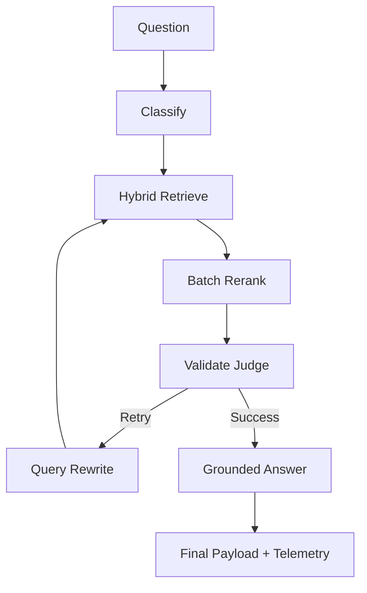

# Ultra Doc-Intelligence (Production-Ready)

Agentic GraphRAG assistant for logistics document Q&A using **Memgraph 3.0**, **LlamaIndex**, **LangGraph**, and **LiteLLM**. Optimized for high-precision extraction with **<5% hallucination rates**.

## 🏗️ Architecture (Tier 1 & 2 Optimized)



**Workflow Highlights:**
- **Batch Reranker**: Uses an LLM-based reranking layer to prune noise and resolve entity confusion (e.g., distinguishing between Shipper and Consignee addresses).
- **Judge-First Safety**: Replaced simple similarity thresholds with dual LLM judges for **Context Relevance** and **Task Completion**.
- **Entity-Aware Grounding**: The answerer performs a final audit to ensure every claim is literally supported by the document.

---

## 🛡️ Reliability & Guardrails

We implement a multi-stage validation pipeline to ensure production-grade trustworthiness:

1. **Batch Validation**: A single-call LLM judge evaluates both `Context Score` (Is the answer here?) and `Relevance Score` (Does it match the user intent?).
2. **Reranking Filter**: Top 10 chunks are reranked to ensure the most specific and accurate context is passed to the generator.
3. **Abstention Logic**: The system is trained to return `not_found` rather than hallucinate when data is missing.

### 📊 Observability Suite
Every query captures **25+ metrics**, including:
- **Faithfulness Score**: LLM-based grounding audit.
- **Completeness Score**: Ensuring multi-part questions are fully answered.
- **Telemetry**: Latency breakdown (Retrieve vs Rerank vs Gen), Token Usage, and USD Cost.
- **Failure Mode Classification**: `none`, `hallucination`, `retrieval_failure`, or `not_found`.

---

## 📈 Performance Benchmarks (RC & BOL)

After Tier 1 & 2 optimizations, the system achieved the following results on logistics datasets:

| Metric | Carrier (RC) | Loading (BOL) | Improvement |
| :--- | :--- | :--- | :--- |
| **Hallucination Rate** | **0.0%** | **3.3%** | 📉 **-88% vs Prototype** |
| **Faithfulness** | 97.5% | 86.7% | ✅ High precision grounding |
| **Avg Latency** | 7.51s | 6.81s | ⚡ Optimized batching |
| **Avg Tokens/Query** | 838 | 510 | 💰 Cost-efficient |

---

## ⚙️ Setup & Run

### 1. Start Memgraph
```bash
docker-compose up -d
```

### 2. Configure Environment
```bash
cp .env.example .env
# Add OPENAI_API_KEY
```

### 3. Run Pipeline (API + UI)
```bash
# API
uvicorn app.main:app --reload --port 8000

# UI Dashboard
python -m streamlit run ui/streamlit_app.py
```

## 🚀 Future Roadmap
- [ ] Add OCR fallback (Tesseract/Surya) for scanned image PDFs.
- [ ] Multi-document reasoning (Compare BOL vs RC totals).
- [ ] Implement conversation memory with LangGraph persistence.
- [ ] Native Memgraph Lab visualization integration.
