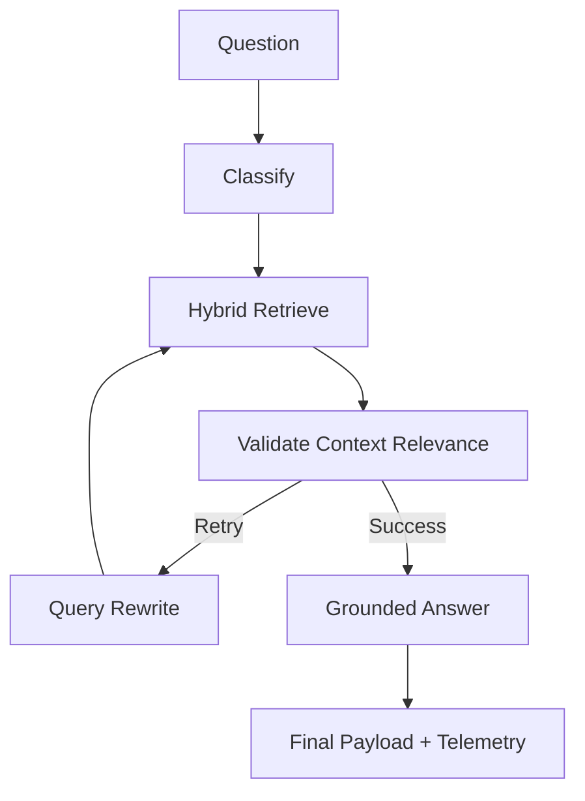

# Ultra Doc-Intelligence (Production-Ready)

Agentic GraphRAG assistant for logistics document Q&A using **Memgraph 3.0**, **LlamaIndex**, **LangGraph**, and **LiteLLM**. Optimized for high-precision extraction with **<5% hallucination rates**.

## 🏗️ Architecture



**Workflow Highlights:**
- **Agentic Pipeline**: LangGraph orchestrates cyclic loops, rewrites, and fast-fail fallbacks dynamically based on query classification.
- **Judge-First Safety**: A dedicated Validation Node runs *before* generation to gauge Context Relevance. If context lacks facts, it fast-fails to `"Not specified in the document."`
- **Strict Grounding Node**: The answerer performs a final audit post-generation, evaluating `faithfulness` against the exact text chunks to verify no extra/inferred information was injected.

---

## 🧩 Chunking Strategy

To prioritize high fact-density and avoid contextual noise:
- **Small-Scale Node Chunking**: We utilize LlamaIndex's `SentenceSplitter` configured for isolated fact retention (`chunk_size=256`, `chunk_overlap=50`). 
- **Graph-Native Extraction**: Top chunks (up to 30 per document) are processed to extract entities (`Shipper`, `Carrier`, `Consignee`) and relationships (`SHIPS_FROM`, `DELIVERS_TO`), linking chunks directly to discrete extracted entities in Memgraph.

---

## 🔍 Retrieval Method

We use a **Hybrid Retrieval** strategy merging embedding similarity with logical graph traversals:
1. **Vector Search (Path A)**: Encoded metadata-filtered lookup using Langchain mapped over Memgraph vector indexes (`top_k=15`).
2. **Graph Traversal (Path B)**: BFS-style retrieval bridging query entities to their specific named entity counterparts in Memgraph.
*The results are deduplicated and capped dynamically (top 12 candidates) to feed the optimal context window.*

---

## 🛡️ Guardrails Approach

A strict set of guardrails ensures high safety for enterprise logistics:
1. **Aggressive Abstention**: If context fails, the system bypasses evaluation loops entirely and safely outputs: `"Not specified in the document."`
2. **Prompt Hardening**: Prompts explicitly forbid formatting standardization and default prefixes (e.g., adding "Fax:" before fax numbers). Enforces complete sentences for reasoning responses.
3. **Hallucination Reductant**: System will flag an uncaptured Hallucination if `faithfulness_score < 0.5` or `answer_relevance < 0.5`, guaranteeing metrics alert on rogue model behavior.

---

## 📊 Confidence Scoring Method

We calculate a rigid **Overall Confidence** by applying a weighted algorithmic composite:
`0.4 * model_confidence + 0.3 * retrieval_confidence + 0.3 * faithfulness_score`

- **Faithfulness Score**: A post-generation LLM judge (0.0 to 1.0) explicitly validating if the answer exists wholly in the retrieved text chunks.
- **Retrieval Confidence**: Synthesized from vector cosine similarity.
- **Model Confidence**: Confidence generated by the underlying model natively.

---

## 🚨 Failure Cases

The pipeline categorizes failures into observable states via extensive telemetry:
- **`not_found`**: The system behaves safely, correctly identifying that the context didn't support the answer and emitting the expected abstention text.
- **`hallucination`**: The system attempted to answer, but our post-generation Judge evaluated a low faithfulness/relevance margin.
- **`retrieval_failure`**: No chunks whatsoever were returned during Hybrid Retrieval.

---

## ⚙️ Setup & Run

### 1. Start Memgraph
```bash
docker-compose up -d
```

### 2. Configure Environment
```bash
cp .env.example .env
# Add OPENAI_API_KEY
```

### 3. Run Pipeline (API + UI)
```bash
# API
uvicorn app.main:app --reload --port 8000

# UI Dashboard
python -m streamlit run ui/streamlit_app.py
```

---

## 🚀 Improvement Ideas (Future Roadmap)
- [ ] **Document Re-Ingestion Scripts**: Automate `Memgraph` wiping & DB re-ingestion after chunk parameters change.
- [ ] **OCR Fallbacks**: Add Tesseract/Surya for unreadable or scanned logistics image PDFs.
- [ ] **Cross-Document Reasoning**: Compare discrepancies across different PDFs (e.g. BOL totals vs RC records).
- [ ] **Conversational Memory**: Implement Chat persistence using standard LangGraph `checkpointer`.
